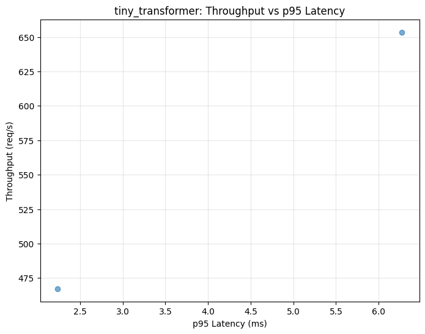
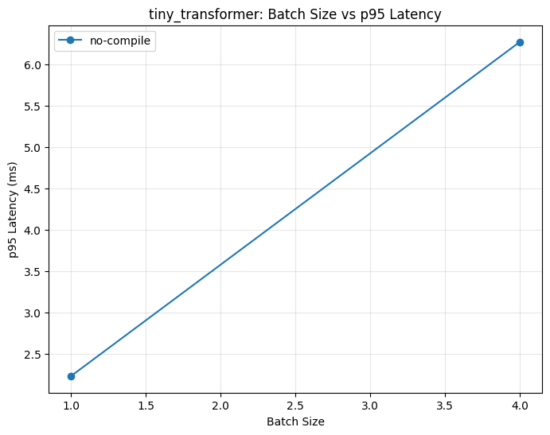

# Inference Benchmarking Report

## Environment

- Python: 3.11.7
- PyTorch: 2.10.0
- Platform: Darwin
- CPU count: 8

## Recommendations

Constraint: **balanced**

- tiny_transformer: batch=1, no-compile, threads=4 → p95=2.2ms, throughput=467.3 req/s

## Top Configurations by Balanced Score

### tiny_transformer

| Batch | Compile | Threads | p95 (ms) | Throughput (req/s) | Score |
|-------|---------|---------|----------|-------------------|-------|
| 1 | no | 4 | 2.2 | 467.3 | 209.21 |
| 4 | no | 4 | 6.3 | 653.5 | 104.15 |

## Plots

### tiny_transformer

